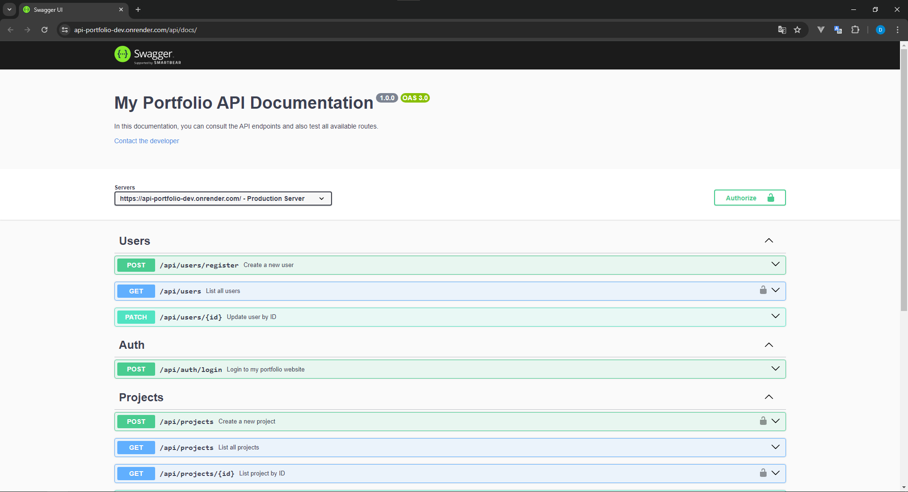

<div align="center">
  
  
  
  
  
  
  
  
  
  
  
</div>

# API-PORTFÓLIO
API criada para o portfólio de projetos, com o intuito de mostrar as habilidades e conhecimentos adquiridos ao longo do tempo.


## Tecnologias utilizadas

**Back-end**
- Node.js
- Express
- MongoDB Atlas
- Mongoose
- JWT
- Bcrypt

**Front-end**
- React
- React Router
- Axios
- Styled Components

**Ferramentas**
- Visual Studio Code
- Insomnia
- Git e GitHub
- Render
- Netlify

## Estrutura de pastas

```
api-portfolio
├── src
│   ├── controllers
│   │   ├── auth.controller.js
│   │   ├── project.controller.js
│   │   └── user.controller.js
│   ├── database
│   │   └── db.js
│   ├── middlewares
│   │   └── admin.middlewares.js
|   |   └── auth.middlewares.js
|   |   └── global.middlewares.js
│   ├── models
│   │   ├── Project.js
│   │   └── User.js
│   ├── routes
│   │   ├── auth.routes.js
│   │   ├── project.routes.js
|   |   ├── swagger.routes.js
│   │   └── user.routes.js
│   ├── services
│   │   ├── auth.services.js
│   │   ├── project.services.js
│   │   └── user.services.js
│   ├── index.js
|   └── swagger.json
├── .env
├── .gitignore
├── package-lock.json
├── package.json
└── README.md
```

## Funcionalidades

Back-end:
- [x] Cadastro de usuários
- [x] Login de usuários
- [x] Cadastro de projetos
- [x] Edição de projetos
- [x] Exclusão de projetos
- [x] Curtir projetos/deixar de curtir projetos
- [x] Comentar projetos

## Observações

Por se tratar de um projeto pessoal, não terá mais de um administrador, apenas um usuário administrador que terá permissão para adicionar, editar e excluir projetos.

Para você testar a API utilize o link da descrição ou faça um fork do projeto e crie um arquivo .env na raiz do projeto com as seguintes variáveis de ambiente:

```
PORT=3000
MONGODB_URI=URL_DO_SEU_BANCO_DE_DADOS
JWT_SECRET=SEU_JWT_SECRET
```

## Autenticação

Para autenticação de usuários, será utilizado o JWT (JSON Web Token), onde o usuário irá se cadastrar e fazer login para obter um token de acesso. Este token será utilizado para acessar as rotas protegidas da aplicação.

Caso queira testar as funcionalidades de administrador, você deve alterar o campo `role` do usuário para `admin` no banco de dados, fazer login e utilizar o token gerado para acessar as rotas protegidas.

## Permissões

- Administrador: poderá adicionar, editar e excluir projetos
- Usuário: poderá adicionar, editar e excluir comentários, curtir e descurtir projetos e comentários
- Visitante: poderá apenas visualizar os projetos e os comentários

## Rotas

### Usuários

- [x] POST /api/users/register
- [x] GET /api/users
- [x] GET /api/users/:id
- [x] PATCH /api/users/:id

### Autenticação

- [x] POST /api/auth/login

### Projetos

- [x] POST /api/projects *Apenas administrador*
- [x] GET /api/projects 
- [x] GET /api/projects/:id *Apenas administrador*
- [x] PATCH /api/projects/:id *Apenas administrador*
- [x] DELETE /api/projects/:id *Apenas administrador*
- [x] PATCH /api/projects/like/:id *Somente logado*
- [x] PATCH /api/projects/comment/:id *Somente logado*
- [x] PATCH /api/projects/:idProject/:idComment *Somente logado*

## Autores

- Djhonatan Parreira | [GitHub](https://github.com/djhonantanparreira) - [LinkedIn](https://www.linkedin.com/in/djhonantanparreira/)